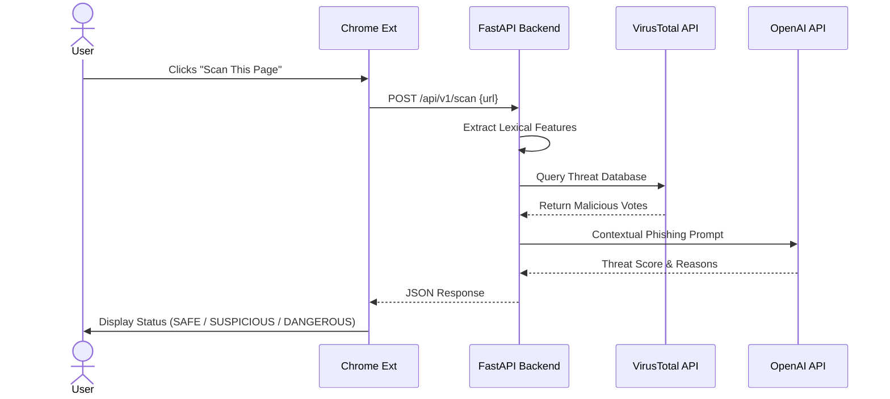

# 🛡️ ThreatLens-AI
**AI-Powered Phishing & Malicious URL Scanner**

A full-stack cybersecurity extension that evaluates URL threats in real-time. It calculates a unified threat score by combining client-side URL lexical analysis, VirusTotal threat intelligence, and OpenAI GPT-4o-mini contextual reasoning.

---

## 🚀 System Architecture

✨ Core Features
Real-time Tab Detection: Automatically pulls the active URL from your Chrome tab using Manifest V3 APIs.

Lexical Feature Extraction: Analyzes domain structure, IP presence, typosquatting keywords, and URL lengths.

VirusTotal Intelligence: Queries global threat databases for reported domain flags.

AI Contextual Analysis: Leverages LLMs to evaluate subtle phishing patterns and malicious intent.

Modern Dark UI: Lightweight, responsive popup dashboard with clean visual threat indicators.

🛠️ Tech Stack
Component	Technology	Description
Frontend	HTML5, CSS3, Vanilla JS	Chrome Extension (Manifest V3)
Backend	Python 3.11+, FastAPI	High-performance API server
Server	Uvicorn	ASGI web server implementation
External APIs	OpenAI, VirusTotal	Threat intelligence & LLM reasoning
⚙️ Installation & Setup
1. Backend Setup
Bash
# Clone the repository
git clone [https://github.com/tracolerd/ThreatLens-AI.git](https://github.com/tracolerd/ThreatLens-AI.git)
cd ThreatLens-AI/backend

# Create and activate virtual environment
python3 -m venv venv
source venv/bin/activate  # Windows: venv\Scripts\activate

# Install dependencies
pip install -r requirements.txt
Environment Variables:
Create a .env file in the backend directory and add your API keys:

Code snippet
OPENAI_API_KEY=your_actual_openai_api_key
VIRUSTOTAL_API_KEY=your_actual_virustotal_api_key
Start the Server:

Bash
uvicorn main:app --reload
2. Chrome Extension Setup
Open Google Chrome and navigate to chrome://extensions/.

Enable Developer mode (toggle at the top-right corner).

Click Load unpacked and select the extension/ directory from this project.

Pin ThreatLens-AI to your browser toolbar.

📡 API Endpoint Reference
POST /api/v1/scan
Request:

JSON
{
  "url": "[https://example-phishing-site.com/login](https://example-phishing-site.com/login)"
}
Response:

JSON
{
  "threat_score": 85,
  "status": "DANGEROUS",
  "reasons": [
    "Domain contains suspicious keyword 'login' with IP redirect.",
    "Flagged by 4 VirusTotal security vendors.",
    "OpenAI detected credential harvesting patterns in URL path."
  ]
}
🔒 Security & Privacy Notice
Note: URLs sent to the backend are evaluated transiently and are strictly not stored in any database. Sensitive query parameters are stripped during heuristic extraction to preserve user privacy.
